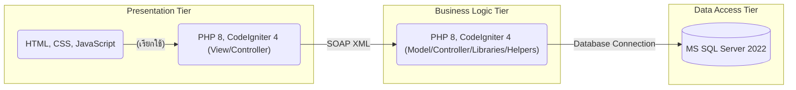

# โครงการพัฒนาซอฟต์แวร์ DOEB Phase 3

[](https://www.php.net/)
[](https://codeigniter.com/)
[](https://www.docker.com/)
[](https://www.microsoft.com/en-us/sql-server/sql-server-2022)
[](https://opensource.org/licenses/MIT)




**ภาพรวมโครงการ**

โครงการนี้เป็นการพัฒนาซอฟต์แวร์ประเภท **เว็บแอปพลิเคชันสำหรับบริหารจัดการโครงการ DOEB ระยะที่ 3** โดยมีวัตถุประสงค์เพื่อ **[???]** พัฒนาด้วยเทคโนโลยีหลักคือ 
- PHP 8.1.x 
- บน Framework CodeIgniter 4 
- ทำงานบน Apache Web Server 
- ใช้ MS SQL Server 2022
- สถาปัตยกรรม N-Tier
- Tier ทั้งหมดเป็น Docker เพื่อให้มีความยืดหยุ่นสูง ง่ายต่อการพัฒนาเพิ่มเติม การบำรุงรักษา และการปรับขนาด  

**สถาปัตยกรรมระบบ (N-Tier Architecture)**

ระบบนี้ถูกออกแบบตามสถาปัตยกรรม N-Tier ซึ่งแบ่งการทำงานออกเป็น 3 ระดับชั้นหลัก ๆ ที่ทำงานแยกกันบน Server หรือ Container เพื่อให้เกิดการแบ่งแยกความรับผิดชอบและเพิ่มความสามารถในการปรับขนาด:

1.  **Tier ที่ 1: Presentation Tier (Frontend/UI/UX)**
    * **หน้าที่:** นำเสนอส่วนติดต่อผู้ใช้งาน (User Interface) และมอบประสบการณ์ที่ดีในการใช้งาน (User Experience) แก่ผู้ใช้ รวมถึงการรับคำสั่งจากผู้ใช้และแสดงผลข้อมูล
    * **เทคโนโลยี:** PHP 8, CodeIgniter 4 (ส่วนของ View และ Controller ที่เกี่ยวข้องกับการแสดงผล) อาจมีการใช้เทคโนโลยี Frontend อื่น ๆ เพิ่มเติม เช่น HTML, CSS, JavaScript Framework/Library (ระบุหากมี เช่น Bootstrap, jQuery, Vue.js, React เป็นต้น)
    * **การเชื่อมต่อ:** สื่อสารกับ Business Logic Tier (Tier 2) ผ่าน **SOAP XML**

2.  **Tier ที่ 2: Business Logic Tier (Application/Service Layer)**
    * **หน้าที่:** ประมวลผลตรรกะทางธุรกิจ (Business Logic) ทั้งหมดของระบบ ทำหน้าที่เป็นตัวกลางในการรับคำร้องจาก Presentation Tier และส่งต่อไปยัง Data Access Tier รวมถึงการจัดการข้อมูลและการตรวจสอบความถูกต้อง
    * **เทคโนโลยี:** PHP 8, CodeIgniter 4 (ส่วนของ Model, Controller ที่จัดการ Logic, Libraries, Helpers)
    * **การเชื่อมต่อ:**
        * รับคำร้องจาก Presentation Tier (Tier 1) ผ่าน **SOAP XML**
        * เชื่อมต่อและสื่อสารกับ Database Server Tier (Tier 3) เพื่อเข้าถึงและจัดการข้อมูล

3.  **Tier ที่ 3: Data Access Tier (Database Server)**
    * **หน้าที่:** ให้บริการระบบจัดการฐานข้อมูล (Database Management System) สำหรับจัดเก็บ จัดการ และเรียกค้นข้อมูลทั้งหมดของระบบ รวมถึงการรับประกันความถูกต้องและความปลอดภัยของข้อมูล
    * **เทคโนโลยี:** MS SQL Server 2022
    * **การเชื่อมต่อ:** อนุญาตให้เชื่อมต่อจาก Business Logic Tier (Tier 2) เท่านั้น โดยมีการกำหนดสิทธิ์การเข้าถึงที่เหมาะสมเพื่อความปลอดภัยของข้อมูล

**หลักการเขียนโค้ด**

ทีมพัฒนาจะยึดมั่นและปฏิบัติตามหลักการเขียนโค้ดที่ดี เพื่อให้โค้ดมีคุณภาพสูง ง่ายต่อการอ่าน เข้าใจ ทดสอบ และบำรุงรักษา:

* **SOLID Principles:** นำหลักการ Single Responsibility, Open/Closed, Liskov Substitution, Interface Segregation, และ Dependency Inversion มาประยุกต์ใช้ในการออกแบบและพัฒนา เพื่อให้โค้ดมีความยืดหยุ่น ขยายง่าย ลดการพึ่งพาซึ่งกันและกัน และง่ายต่อการเปลี่ยนแปลง
* **Clean Code:** ให้ความสำคัญกับการเขียนโค้ดที่ชัดเจน สื่อความหมายได้ดี มีชื่อตัวแปรและฟังก์ชันที่สื่อถึงหน้าที่การทำงาน หลีกเลี่ยงความซับซ้อนที่ไม่จำเป็น และเป็นไปตามมาตรฐานการเขียนโค้ดของ PHP และ CodeIgniter
* **Coding Standards:** ปฏิบัติตามมาตรฐานการเขียนโค้ดของ **[PHP Standards Recommendations - PHP-FIG](https://www.php-fig.org/psr/)** เพื่อให้โค้ดในภาพรวมมีความสอดคล้องกัน
* **Code Reviews:** มีกระบวนการตรวจสอบโค้ด (Code Review) ก่อนที่จะรวมโค้ดเข้าสู่ Branch หลัก เพื่อให้มั่นใจในคุณภาพของโค้ดและแลกเปลี่ยนความรู้ระหว่างทีมพัฒนา

**แนวทางการทำงานร่วมกันบน GitLab**

เพื่อให้การทำงานร่วมกันในทีมเป็นไปอย่างราบรื่น มีประสิทธิภาพ และสามารถติดตามการเปลี่ยนแปลงของโค้ดได้อย่างเป็นระบบ เราจะใช้ Git Flow ร่วมกับ GitLab ดังนี้:

* **Branch หลัก:**
    * `main` (**หรือ `production`**): สำหรับเก็บโค้ดที่พร้อมสำหรับการนำไปใช้งานจริง (Production-ready) และมีการ Tag Version อย่างเป็นทางการ
    * `develop`: สำหรับเก็บโค้ดที่อยู่ระหว่างการพัฒนาและทดสอบในภาพรวม ถือเป็น Branch หลักสำหรับการรวมโค้ดจาก Feature Branches ต่าง ๆ
* **Branch สำหรับพัฒนา (Feature/Task Branches):**
    * นักพัฒนาแต่ละคนจะสร้าง Branch ใหม่แยกจาก `develop` สำหรับการพัฒนาแต่ละ Function, Feature, การแก้ไข Bug, การปรับปรุง (Enhancement) หรือ Task อื่น ๆ โดยมีชื่อ Branch ที่สื่อถึงวัตถุประสงค์ของการเปลี่ยนแปลงนั้น ๆ (เช่น `feature/user-authentication`, `fix/login-error`, `task/update-documentation`)
* **Merge Request (MR) / Pull Request (PR):**
    * เมื่อพัฒนาโค้ดบน Branch ของตนเองเสร็จสิ้นและต้องการรวมโค้ดเข้ากับ `develop` Branch นักพัฒนาจะต้องสร้าง Merge Request (ใน GitLab) หรือ Pull Request (ใน GitHub) เพื่อแจ้งให้ทีมทราบและขออนุมัติการรวมโค้ด
* **การตรวจสอบ Merge Request:**
    * จะมีผู้รับผิดชอบ (อาจเป็น Lead Developer หรือผู้ที่ได้รับมอบหมาย) ในการตรวจสอบโค้ดที่ส่งมาใน Merge Request อย่างละเอียด ก่อนที่จะทำการ Merge เพื่อให้มั่นใจว่าโค้ดมีคุณภาพ ตรงตามข้อกำหนด และไม่มีข้อผิดพลาด
    * นักพัฒนาควรทำการทดสอบการรวมโค้ดกับ `develop` Branch ใน Local Repository ของตนเองก่อน (โดยใช้คำสั่ง `git pull origin develop` แล้ว Merge เข้ากับ Branch ของตนเอง) เพื่อแก้ไข Conflict ที่อาจเกิดขึ้นบน Remote Repository ล่วงหน้า
* **Hotfix Branches:**
    * สำหรับกรณีที่มี Bug สำคัญที่ต้องแก้ไขอย่างเร่งด่วนบน Production Branch จะมีการสร้าง Branch แยกจาก `main` (หรือ `production`) โดยมีชื่อนำหน้าด้วย `hotfix/` เมื่อแก้ไขเสร็จแล้วจะ Merge กลับทั้ง `main` (หรือ `production`) และ `develop` เพื่อให้ทั้งสอง Branch มีโค้ดที่แก้ไขล่าสุด
* **Release Branches (Optional):**
    * ในบาง Workflow อาจมีการสร้าง Release Branch แยกจาก `develop` ก่อนที่จะ Merge เข้าสู่ `main` (หรือ `production`) เพื่อใช้ในการทดสอบขั้นสุดท้ายและเตรียมการสำหรับการ Deploy

**การบริหารจัดการ Issue และ Task ด้วย Issue Board**

Project Manager (PM), Business Analyst (BA), และ Application Support (AS) จะใช้ GitLab Issue Board (หรือระบบ Issue Tracking อื่น ๆ ที่ระบุ) ในการบริหารจัดการ Issue และ Task ต่าง ๆ ที่เกี่ยวข้องกับโครงการ เพื่อให้การทำงานมีความชัดเจน สามารถติดตามความคืบหน้า และสื่อสารกันได้อย่างมีประสิทธิภาพ:

* **การสร้าง Issue:** PM, BA, และ AS (หรือผู้ที่พบปัญหา/ต้องการเสนอแนะ) จะเป็นผู้สร้าง Issue เมื่อพบปัญหาการใช้งานจากผู้ใช้งาน รายงาน Bug หรือเมื่อต้องการสื่อถึงการพัฒนา Enhancement, การเพิ่มหรือแก้ไข Function/Feature
* **การมอบหมายงาน:** PM จะเป็นผู้มอบหมาย Issue หรือ Task ให้กับนักพัฒนาที่เหมาะสม
* **การใช้งานโดยนักพัฒนา:** นักพัฒนาจะใช้ Issue Board เพื่อติดตามงานที่ได้รับมอบหมาย อัปเดตสถานะความคืบหน้า แสดงความคิดเห็น หรือสอบถามข้อมูลเพิ่มเติม เพื่อให้ทุกคนในทีมรับทราบสถานะของงานได้อย่างทั่วถึง
* **การปิด Issue:** เมื่อ Issue หรือ Task นั้น ๆ เสร็จสิ้นและได้รับการตรวจสอบแล้ว ผู้ที่รับผิดชอบจะทำการปิด Issue

**Label บน Issue Board**

เราจะใช้ Label เพื่อสื่อถึงสถานะ ประเภท และความสำคัญของแต่ละ Issue/Task เพื่อให้การจัดการและจัดลำดับความสำคัญของงานเป็นไปอย่างมีประสิทธิภาพ:

* **สถานะ:**
    1.  `Open`: สำหรับ Issue ใหม่ที่ยังไม่ได้ถูกนำมาพิจารณาหรือมอบหมายงาน
    2.  `To Do`: สำหรับ Issue ที่ได้รับการพิจารณาแล้ว แต่ยังไม่ได้เริ่มดำเนินการ
    3.  `In Progress`: สำหรับ Issue ที่กำลังอยู่ในระหว่างการพัฒนาหรือแก้ไข
    4.  ~~`Ready for Review`: สำหรับ Issue ที่พัฒนาหรือแก้ไขเสร็จแล้วและพร้อมสำหรับการตรวจสอบโค้ด~~ **(ขั้นตอนนี้ตัดออก)**
    5.  `Ready for Testing`: สำหรับ Issue ที่ผ่านการตรวจสอบโค้ดแล้วและพร้อมสำหรับการทดสอบโดย QA หรือผู้ที่เกี่ยวข้อง
    6.  `Ready for Deployment`: สำหรับ Issue ที่ผ่านการทดสอบแล้วและรอการนำไปใช้งานจริง
    7.  `Closed`: สำหรับ Issue ที่ได้รับการแก้ไข/ดำเนินการเรียบร้อยแล้ว
    8.  `Cancel`: สำหรับ Issue ที่ไม่ต้องดำเนินการ
* **ประเภท:**
    1.  `Bug`: ระบุว่าเป็น Issue ที่เกิดจากข้อผิดพลาดในการทำงานของระบบ
    2.  `Feature`: ระบุว่าเป็น Issue ที่เกี่ยวข้องกับการเพิ่ม Function/Feature ใหม่ให้กับระบบ
    3.  `Enhancement`: ระบุว่าเป็น Issue ที่เกี่ยวข้องกับการปรับปรุง Function/Feature ที่มีอยู่ให้ดีขึ้น
    4.  `Suggestion`: ระบุว่า Issue เป็นข้อเสนอแนะ และยังไม่มีการตัดสินใจว่าจะดำเนินการหรือไม่
    5.  `Discussion`: ระบุว่าเป็น Issue ที่ต้องการการพูดคุยหรือแลกเปลี่ยนความคิดเห็นเพิ่มเติม
    6.  `Documentation`: ระบุว่าเป็น Issue ที่เกี่ยวข้องกับการปรับปรุงหรือเพิ่มเติมเอกสาร
* **ความสำคัญ (Priority):**
    1.  `Low`: ความสำคัญต่ำ สามารถดำเนินการได้ในลำดับหลัง
    2.  ~~`Medium`: ความสำคัญปานกลาง ควรดำเนินการตามลำดับ~~ (ตัดออก)
    3.  `High`: ความสำคัญสูง ควรดำเนินการโดยเร็ว
    4.  `Critical`: ความสำคัญสูงสุด ต้องได้รับการแก้ไขโดยเร่งด่วนที่สุด
* **อื่น ๆ (Optional):** อาจมีการเพิ่ม Label อื่น ๆ ตามความจำเป็นของโครงการ เช่น `Frontend`, `Backend`, `API`, `Database` เพื่อระบุส่วนของระบบที่เกี่ยวข้อง

**การ Deploy**

การ Deploy ระบบจะดำเนินการโดยการ Deploy ทุก Tier ในรูปแบบ Docker Container เพื่อให้การติดตั้งและจัดการเป็นไปอย่างง่ายดาย สม่ำเสมอ และสามารถทำซ้ำได้ โดยจะมีการ **[อธิบายรายละเอียดเพิ่มเติมเกี่ยวกับการ Deploy]** และมีการ Map Volume ในส่วนของ Folder ที่เก็บ Source Code ของ PHP (สำหรับ Tier 1 และ 2) เพื่อให้ง่ายต่อการปรับปรุงและแก้ไขโค้ดในภายหลังโดยไม่ต้อง Rebuild Container ใหม่ทุกครั้ง

**การเตรียมเครื่องสำหรับนักพัฒนา (Developer Setup)**

เพื่อให้การเริ่มต้นพัฒนาเป็นไปอย่างราบรื่น นักพัฒนาจะต้องติดตั้งและตั้งค่าเครื่องมือและสภาพแวดล้อมที่จำเป็นดังนี้:

1.  **ติดตั้ง Docker:** ติดตั้ง Docker Desktop (สำหรับ Windows/macOS) หรือ Docker Engine และ Docker Compose (สำหรับ Linux) ตามระบบปฏิบัติการของคุณ สามารถดาวน์โหลดและติดตั้งได้จาก [https://www.docker.com/](https://www.docker.com/) และ [https://docs.docker.com/compose/install/](https://docs.docker.com/compose/install/)
2.  **ติดตั้ง VS Code:** ติดตั้ง Visual Studio Code ซึ่งเป็น Editor ที่แนะนำสำหรับการพัฒนาโครงการนี้ พร้อมด้วย Extensions ที่จำเป็นสำหรับ PHP และ Docker เพื่อเพิ่มประสิทธิภาพในการทำงาน สามารถดาวน์โหลดได้จาก [https://code.visualstudio.com/](https://code.visualstudio.com/)
3.  **ติดตั้ง PHP:** ตรวจสอบให้แน่ใจว่า PHP เวอร์ชั่น **8.1 หรือสูงกว่า** ติดตั้งอยู่ในเครื่องของคุณ (แนะนำให้ใช้เวอร์ชั่นล่าสุดที่ Stable) หากยังไม่มี สามารถดาวน์โหลดและติดตั้งได้จาก [https://www.php.net/downloads.php](https://www.php.net/downloads.php)
4.  **ติดตั้ง Composer:** Composer เป็น Dependency Manager สำหรับ PHP ติดตั้ง Composer ตามคำแนะนำในเว็บไซต์ [https://getcomposer.org/](https://getcomposer.org/)
5.  **ติดตั้งส่วนขยาย PHP ที่จำเป็น:** ตรวจสอบให้แน่ใจว่าส่วนขยาย PHP เหล่านี้ถูกเปิดใช้งานอยู่ในไฟล์ `php.ini` ของคุณ:
    * `intl` (Internationalization)
    * `mbstring` (Multibyte String)
    * `json` (JavaScript Object Notation) - โดยปกติจะเปิดใช้งานอยู่แล้ว
    * `pdo` และ Driver สำหรับ MS SQL Server (`pdo_sqlsrv` หรือ `sqlsrv`) - จำเป็นสำหรับการเชื่อมต่อฐานข้อมูล
    * `libxml` (libxml2) - อาจจำเป็นสำหรับ SOAP หรือ XML อื่น ๆ
    * `curl` (Client URL Library) - สำหรับการทำ HTTP Request
    * `gd` (GD Library) - สำหรับการจัดการรูปภาพ (หากมีการใช้งาน)
    * ส่วนขยายอื่น ๆ ที่ระบุใน `composer.json`

    **คำเตือน:** PHP เวอร์ชั่น 7.4 สิ้นสุดการสนับสนุนเมื่อวันที่ 28 พฤศจิกายน 2565 และ PHP เวอร์ชั่น 8.0 สิ้นสุดการสนับสนุนเมื่อวันที่ 26 พฤศจิกายน 2566 **โปรดอัปเกรดเป็น PHP เวอร์ชั่น 8.1 หรือสูงกว่าทันที** เพื่อความปลอดภัยและการรองรับ Feature ใหม่ ๆ PHP เวอร์ชั่น 8.1 จะสิ้นสุดการสนับสนุนในวันที่ 25 พฤศจิกายน 2526 (ค.ศ. 2026)
6.  **Clone Repository:** Clone Repository ของโครงการนี้จาก GitLab มายังเครื่องของคุณโดยใช้คำสั่ง:
    ```bash
    git clone https://git.nidprotech.com/nid_doeb_phase_3/doeb_p3_backend.git
    git clone https://git.nidprotech.com/nid_doeb_phase_3/doeb_p3_frontend.git
    ```
7.  **ตั้งค่า Environment:**
    * คัดลอกไฟล์ `.env.example` (หรือ `env`) เป็น `.env`
    * ปรับตั้งค่าในไฟล์ `.env` ให้เหมาะสมกับการพัฒนาของคุณ โดยเฉพาะ `baseURL`, การตั้งค่าฐานข้อมูล (แม้ว่า Tier 3 จะแยกอยู่ แต่การตั้งค่าใน Tier 1 และ 2 อาจจำเป็นสำหรับการพัฒนาในบางส่วน), และการตั้งค่าอื่น ๆ ที่เกี่ยวข้องกับ Environment
8.  **ติดตั้ง Dependencies:** ภายใน Root Directory ของ Project ให้รันคำสั่ง Composer เพื่อติดตั้ง Dependencies ที่จำเป็น:
    ```bash
    composer install
    ```
9.  **การตั้งค่า Web Server (Apache):**
    * ตรวจสอบให้แน่ใจว่า Apache Web Server ติดตั้งและทำงานบนเครื่องของคุณ
    * กำหนด Virtual Host ให้ชี้ไปยัง Folder `public` ภายใน Project Directory ของคุณ **สำคัญ:** ต้องชี้ไปที่ `public` Folder เท่านั้น ไม่ใช่ Root ของ Project เนื่องจากไฟล์ `index.php` ถูกย้ายไปอยู่ใน `public` Folder เพื่อความปลอดภัยและการแยกส่วนประกอบที่ดีขึ้น
    * ตรวจสอบให้แน่ใจว่า Module `mod_rewrite` ถูกเปิดใช้งานใน Apache Configuration (`httpd.conf` หรือไฟล์ Virtual Host) เพื่อให้ CodeIgniter สามารถจัดการ Routing ได้อย่างถูกต้อง

    **ตัวอย่าง Virtual Host Configuration (อาจแตกต่างกันไปขึ้นอยู่กับการตั้งค่า Apache ของคุณ):**
    ```apache
    <VirtualHost *:80>
        ServerName your_project.local
        DocumentRoot "/path/to/your/project/public"
        <Directory "/path/to/your/project/public">
            Options Indexes FollowSymLinks
            AllowOverride All
            Require all granted
        </Directory>
        ErrorLog "<span class="math-inline">\{APACHE\_LOG\_DIR\}/error\.log"
CustomLog "</span>{APACHE_LOG_DIR}/access.log combined"
    </VirtualHost>
    ```
    อย่าลืมแก้ไข `/etc/hosts` ไฟล์ของคุณเพื่อ Map `your_project.local` ไปยัง `127.0.0.1` (หรือ IP Address ของเครื่องคุณ) และ Restart Apache Server หลังจากตั้งค่า Virtual Host

10. **Docker (Optional แต่แนะนำ):**
    * สำหรับนักพัฒนาที่ต้องการใช้ Docker ในการพัฒนา สามารถศึกษา `Dockerfile` และ `docker-compose.yml` (ถ้ามี) ที่อยู่ใน Repository เพื่อสร้างและรัน Container สำหรับแต่ละ Tier ได้ ซึ่งจะช่วยให้ Environment ในการพัฒนามีความสอดคล้องกับ Production มากยิ่งขึ้น
    * ตรวจสอบให้แน่ใจว่า Docker Daemon ทำงานอยู่ก่อนที่จะรัน Container ด้วยคำสั่ง `docker-compose up -d` (หากมีไฟล์ `docker-compose.yml`)

**เอกสารเพิ่มเติม**

* **คู่มือผู้ใช้ CodeIgniter 4:** [https://codeigniter.com/userguide4/](https://codeigniter.com/userguide4/)
* **เว็บไซต์หลัก CodeIgniter:** [https://codeigniter.com/](https://codeigniter.com/)
* **เอกสาร Docker:** [https://docs.docker.com/](https://docs.docker.com/)
* **เอกสาร Docker Compose:** [https://docs.docker